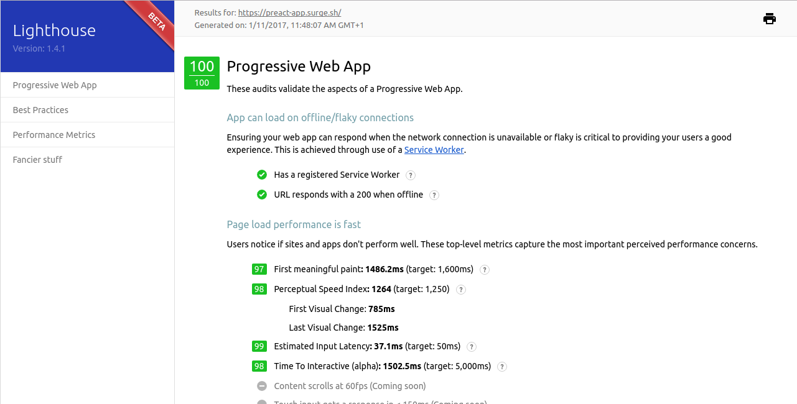

# Preact Simple Starter
**It's highly recommended to use [Preact-CLI](https://github.com/developit/preact-cli)**

[](https://travis-ci.org/ooade/fetch-gifs) [](https://codeclimate.com/github/ooade/PreactSimpleStarter/badges)

PWA Simple Starter with Preact, Webpack 2 and your favorite React related packages :rocket:

This App uses:
  - Preact
  - Preact-mdl
  - React-Router
  - Redux
  - React-Helmet
  - Sass
  - Webpack Dashboard(For Bundle Analysis)

JS Build files:
 - app.js - 78.6kb (17kb gzipped)
 - vendor.js - 46.3kb (12.5kb gzipped)


_100/100 on lighthouse 1.4.1 audits_

# Quick-Start Guide

- [Installation](#installation)
- [Development Workflow](#development-workflow)

## Installation

**1. Clone this repo:**

```sh
git clone https://github.com/ooade/PreactSimpleStarter.git
cd PreactSimpleStarter
```


**2. Make it your own:**

```sh
rm -rf .git && git init && yarn init
```

> :information_source: This re-initializes the repo and sets up your yarn project.


**3. Install the dependencies:**

```sh
yarn install
```

> You're done installing! Now let's get started developing.


## Development Workflow


**4. Start a live-reload development server:**

```sh
yarn run dev
```

> This is a full web server nicely suited to your project. Any time you make changes within the `src` directory, it will rebuild and even refresh your browser.

> :information_source: Try to avoid using Service Worker in your development environment, so you won't need to hard reload the page anytime you make a change.

**5. Generate a production build in `./build`:**

```sh
yarn run build
```

You can now deploy the contents of the `build` directory to production!

## License

MIT
