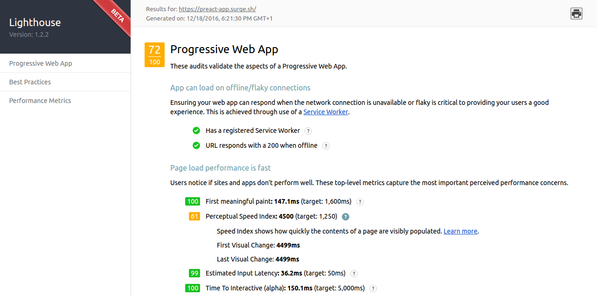

# Preact Simple Starter

Preact + Preact-mdl + React Router + Redux powered by Webpack 2 with Service worker.


_Audits on lighthouse_

We've increased the lighthouse score as promised :smile:

# Quick-Start Guide

- [Installation](#installation)
- [Development Workflow](#development-workflow)

## Installation

**1. Clone this repo:**

```sh
git clone https://github.com/ooade/PreactSimpleStarter.git
cd PreactSimpleStarter
```


**2. Make it your own:**

```sh
rm -rf .git && git init && yarn init
```

> :information_source: This re-initializes the repo and sets up your yarn project.


**3. Install the dependencies:**

```sh
yarn install
```

> You're done installing! Now let's get started developing.


## Development Workflow


**4. Start a live-reload development server:**

```sh
yarn run dev
```

> This is a full web server nicely suited to your project. Any time you make changes within the `src` directory, it will rebuild and even refresh your browser.

> :information_source: Try to avoid using Service Worker in your development environment, because you'll need to hard reload the page anytime you make a change.

**5. Generate a production build in `./build`:**

```sh
yarn run build
```

You can now deploy the contents of the `build` directory to production!

## License

MIT
